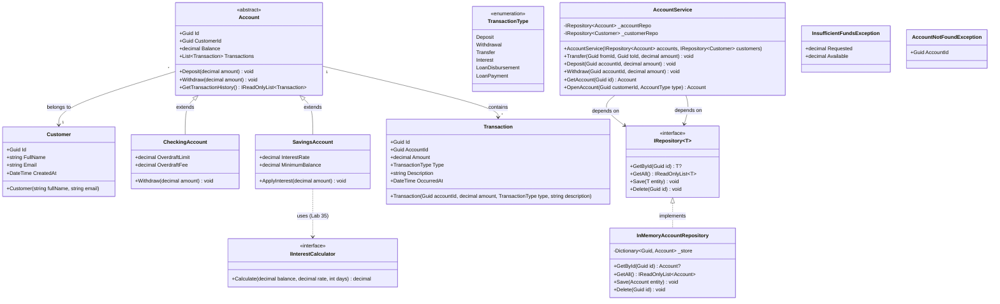

# Class Diagram — BankingSystem

## Нотатки до діаграми

- `Account` — абстрактний клас; `Withdraw` перевизначається в підкласах (поліморфізм).
- `CheckingAccount.Withdraw` дозволяє від'ємний баланс до `OverdraftLimit`, але нараховує `OverdraftFee`.
- `IRepository<T>` — контракт між Application і Infrastructure; дозволяє підміняти in-memory на JSON без зміни сервісів.
- `IInterestCalculator` залишений як заготовка для Lab 35 (Strategy pattern).
- `AccountNotFoundException` і `InsufficientFundsException` наслідують `DomainException`.
