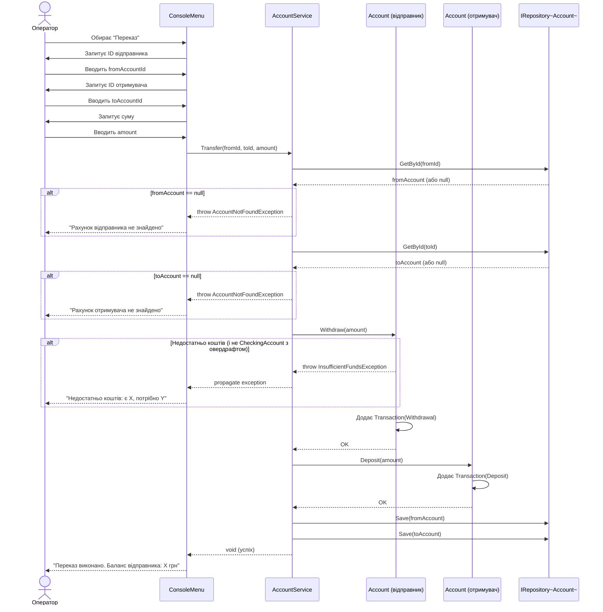

# Sequence Diagram — UC1: Переказ між рахунками

## Ключові рішення

| Рішення | Обґрунтування |
|---------|---------------|
| `AccountService` не знає про конкретний репозиторій | DIP — залежить від `IRepository<Account>`, не від `InMemoryAccountRepository` |
| Виняток кидає `Account.Withdraw`, не сервіс | Інваріант рахунку захищається самим доменним об'єктом (SRP) |
| Дві окремі транзакції (Withdrawal + Deposit) | Аудит-трейл повний; кожна операція атомарно записана на свій рахунок |
| Операція не атомарна між Save(from) і Save(to) | Свідоме обмеження Lab 34; транзакційність — Lab 36 |
